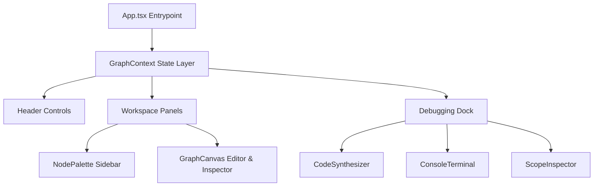

# SynapseFlow — Visual AST Logic Compiler & Interpreter

SynapseFlow is a high-performance, immersive and interactive IDE designed for constructing, compiling, and debugging algorithmic workflows inside a node-graph workspace. It stands as a premium showcase of graph theoretical systems, custom vector math operations, and dynamic code compilers.

### 1. Graph Data Layer & Kahn's Topological Sort
*   **Logical Execution Architecture:** Translates visual node diagrams into a directed acyclic graph (DAG) system.
*   **Cycle Detection:** Executes Kahn's Algorithm on every connection change to evaluate node in-degrees and prevent infinite simulation execution loops.
*   **Topological Execution Queue:** Schedules step-by-step logic sequences by establishing a correct topological ordering of node blocks.

### 2. Custom Bezier and Canvas Vector Dragging Math
*   **Snapping & Drag Hooks:** Custom mouse event tracking translates absolute screen movement deltas into snapped grid vector transformations.
*   **Elastic Cable Math:** Dynamically maps cubic Bezier connector cables between stacked ports:
    $$d = \text{M } (x_1, y_1) \text{ C } (x_1 + o, y_1), (x_2 - o, y_2), (x_2, y_2)$$
*   **Visual Pulse Flow Indicators:** Renders real-time SVG dasharray pulse flows along wires where evaluated data registers are currently traversing.

### 3. Real-Time AST Compilation
*   **Procedural JavaScript Generator:** Traverses nodes top down to synthesize functional, neatly structured standard JavaScript scripts.
*   **Lightweight Syntax Highlighter:** Integrates a bespoke, zero-dependency regex engine tokenizing custom keywords, primitives, scope items, and operations directly into highlighted elements.

### 4. Interactive visual Debugger & Shell Emulator
*   **Control Bay Panel:** Real-time Play, Pause, Single-Step, and velocity adjustment widgets.
*   **Terminal Logs Panel:** Self-scrolling emulated command shell rendering compilation events, stack alerts, and print outputs.
*   **Scope Variable Inspector:** Tracks computed values for output ports and updates active stack variables live in an organized debugging register table.

---

## 🛠️ Architecture & Component Layout



*   **`src/types/graph.ts`**: TypeScript strict typing definitions for visual assets, ports, connection vectors, logs, and simulation contexts.
*   **`src/utils/graphAlgorithms.ts`**: Core graph mathematical formulations (Kahn's Sort, real-time procedural code synthesizer compiler).
*   **`src/context/GraphContext.tsx`**: Unified react state hub orchestrating simulation triggers, step advances, error validations, and preset loaders.
*   **`src/components/`**: Clean, functional modular components rendering palettes, canvases, control panels, syntax editors, registers, and shells.

## 🏃‍♂️ Quick Start Setup

### Installation
Restore dependencies:
```bash
npm install
```

### Run Locally (Dev)
Start the local Vite server:
```bash
npm run dev
```

### Production Bundling
Compile and build optimized, statically optimized output directories:
```bash
npm run build
```
